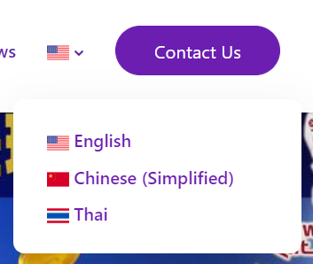
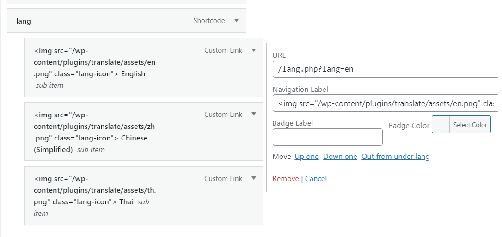
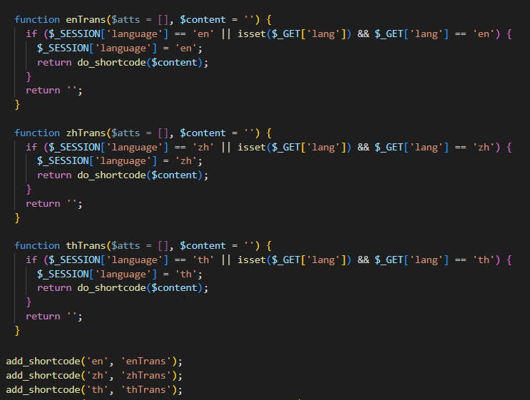
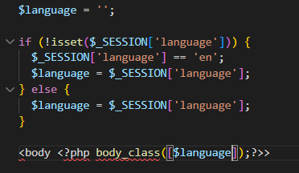

# translation-plugin-wordpress
A translation plugin for wordpress using shortcode without needing to append the language code to the url/slug

# Example Usage of Shortcode :

[en]Hello[/th]
[zh]你好[/zh]
[th]สวัสดี[/th]

# Add the language switcher on the WP Menu
Create a dropdown menu named "lang", then under it, add a custom links that are equal to the number of your prepared languages and point the url to lang.php?lang="languge code here". Make the Navigation label as the respective flag icon uploaded to the assets folder of the plugin.

# Add Additional language
Modify the translate.php file to add more function for the language that you'll need to add 

# Add Language Code as a class on body tag
Access the template header.php to add modify and add the following code to so that you can control the contents dynamically via CSS or JS

